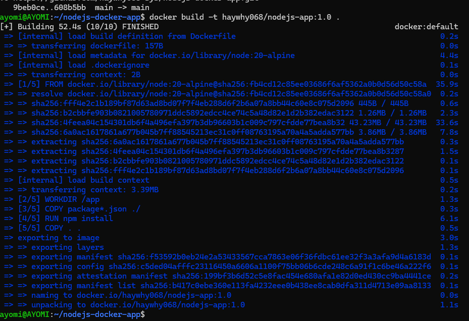
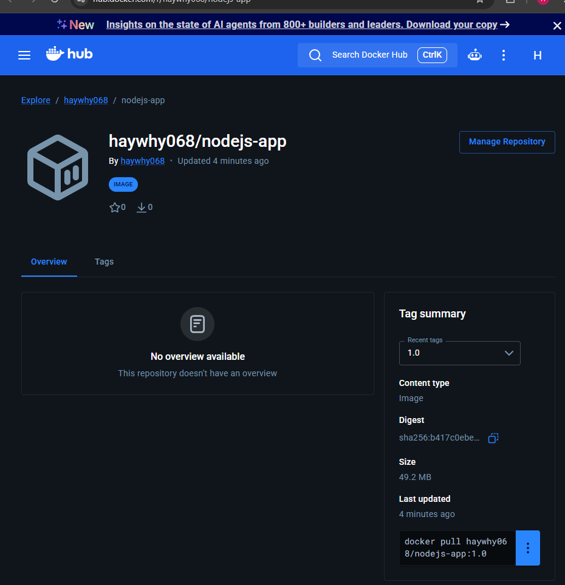
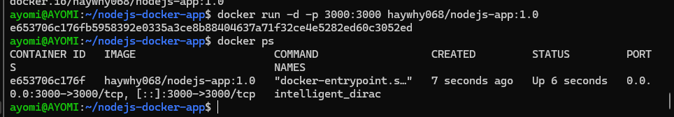

# Node.js Docker Deployment Assignment

**Author:** Ayo-Lawal Owolabi Joseph (CLC/2026/TC-8/0079)

A simple Node.js Express application, containerized with Docker and deployed to Docker Hub.

## Project Files
- `app.js` — Express server
- `package.json` — dependencies
- `Dockerfile` — instructions for building the container image

## How It Works
1. Built a simple Node.js (Express) app that responds with a greeting message.
2. Wrote a Dockerfile to containerize the app using `node:20-alpine` as the base image.
3. Built the image locally and tagged it as `haywhy068/nodejs-app:1.0`.
4. Pushed the image to Docker Hub: [haywhy068/nodejs-app](https://hub.docker.com/r/haywhy068/nodejs-app)
5. Pulled the image back down to verify it works from Docker Hub.
6. Ran the image as a container, mapped to port 3000.

## Screenshots

### 1. Docker Build Command

### 2. Docker Hub Image

### 3. Running Docker Container

### 4. Live Application

## Commands Used
\`\`\`bash
docker build -t haywhy068/nodejs-app:1.0 .
docker login
docker push haywhy068/nodejs-app:1.0
docker pull haywhy068/nodejs-app:1.0
docker run -d -p 3000:3000 haywhy068/nodejs-app:1.0
docker ps
\`\`\`
